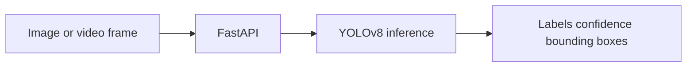

# Real-Time Object Detection

YOLOv8 image/video inference API with an upload boundary that can be extended to webcam or RTSP streams.

Run `pip install -r requirements.txt`, then `uvicorn app.main:app --reload`. POST an image to `/detect`; the model downloads its weights on first use.
